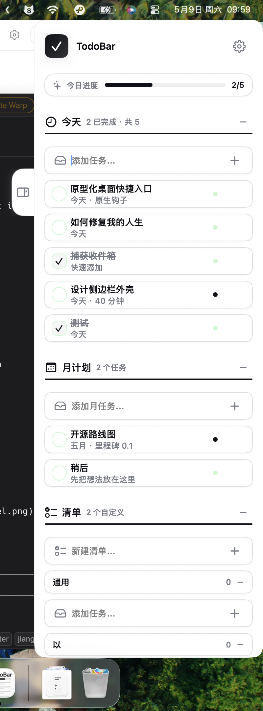

# TodoBar

**贴边而栖，召之即来。**

TodoBar 是一款 macOS 原生待办事项应用，以侧边栏形态常驻屏幕右缘。不占地盘、不挡视线，光标靠近时悄然滑入，移开后徐徐收回——你的任务始终触手可及，却从不打扰。

## 截图

<p align="center">
  
</p>

## 安装

从 [GitHub Release](https://github.com/Autumn0716/todobar/releases) 下载 `.dmg`，双击打开，将 TodoBar 拖入应用程序文件夹。首次打开需在 **系统设置 → 隐私与安全性** 点「仍要打开」。

## 功能

- **今天 / 月计划** 双分区，日常与长远一目了然
- **自定义清单** 随时新建，按需归类
- **流体拖拽排序** 按住任务即可拖动重排，即时跟手
- **优雅删除动画** hover 显示 × 按钮，删除时行向右滑出淡出，空间平滑收拢
- **撤销删除** 删除后底部出现 3 秒 Undo 提示，一键恢复
- **双击勾选** 可选模式，双击任务行切换完成状态
- **聚焦标记** 圆点标记重要任务
- **今日进度** 顶部进度条实时显示完成率
- **贴边把手** 屏幕右侧浮动按钮，点击展开/收起
- **拖拽定位** 按住把手上下拖动调整位置
- **自动显示/隐藏** 鼠标靠近自动展开，离开自动收起
- **浅色/深色主题** 切换后按钮、开关颜色自动反转
- **中英双语** 设置中切换语言，界面即时翻译
- **全参数可调** 面板宽度、行高、动效时长、圆角等 10+ 项设置

## 构建与运行

需要 macOS 14.0+ 和 Xcode 15.0+。

```bash
bash script/build_and_run.sh
```

```bash
swift build -c release --product TodoBar   # Release 构建
swift test                                 # 运行测试
```

## 许可证

MIT
